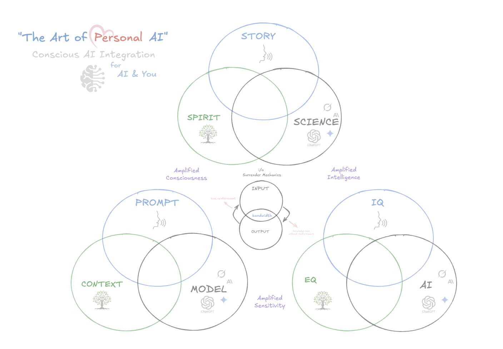

# The Art of Personal AI

**Conscious AI Integration for AI & You**

---

## What is this?

**The Art of Personal AI** is a three‑layer framework that fuses psychotherapy, software engineering, and contemplative practice into one map for conscious human‑AI collaboration.

| Layer                 | Components                   | Amplified Quality | One‑line Purpose                                                                    |
| --------------------- | ---------------------------- | ----------------- | ----------------------------------------------------------------------------------- |
| **1 · Consciousness** | **Story · Spirit · Science** | Awareness         | Align narrative, meaning, and evidence so the mind stays open rather than reactive. |
| **2 · Sensitivity**   | **Prompt · Context · Model** | Precision         | Tune the conversation (human + machine) for nuance that canned chatbots miss.       |
| **3 · Intelligence**  | **IQ · EQ · AI**             | Capability        | Blend raw cognition, emotional attunement, and algorithmic power into action.       |

The Venn‑diagram above visualises how these triads interlock; the sweet‑spots are where resistance drops and insight accelerates.

---

## Why it matters

* **Emotional Bottlenecks ≠ Lack of IQ.** Most people stall on hard topics like AI because the limbic system shouts *danger*—not because they lack raw intelligence.
* **Framework → Flow.** By surfacing hidden resistance (psychotherapy) and rewriting the interface (engineering), we turn fear into fluent skill‑building.
* **Scarcity Edge.** Very few practitioners straddle all three domains.

---

## Author

**Kai** — Psychotherapist (15 yrs) • Software Engineer (5 yrs) • Contemplative (20 yrs). I help people upgrade the story in their heads and the code in their workflows, simultaneously.

**Book early‑bird coaching** → [Free discovery call](https://calendar.app.google/qUc2f4h8cSAnvP9T8) (slots limited while demand is still catching up).

* Connect on LinkedIn → [Rick "Kai" Hallett](https://www.linkedin.com/in/richardhallett86/)
* Say hi on X → `@oceanheart_ai`

---

## License

Creative Commons **CC BY‑NC‑SA 4.0** – Share and adapt with attribution. Non‑commercial use only. For commercial licensing, contact the author.

---

### Proof‑of‑Origin

The Git commit history and SHA‑256 hashes serve as a public, immutable record of authorship and chronology.
